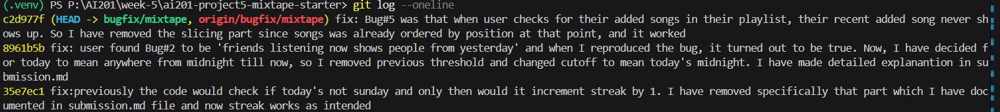

### AI Usage Section

**Instance 1**: I have asked AI to help me understand functions in each file. This was part of my initial note taking process, and there's nothing to override here, AI has helped me understand each function better. I have verified what it returned by going through the code and processing inputs to outputs flow by myself. 

**Instance 2**: My initial plan was to solve bugs #1, #4, #5. However, I didn't have test cases for 4th bug - notification bug. So, I discussed with Claude to write one, and after looking at the cases, I have realized there's no passing case AI was able to generate. The case where when users add a song to the playlist would send a notification was not tested because AI was unable to generate a case for it. I have made some changes in the test case for it to work, however, in the end, I left it to solve later and chose bug #2. 
So, here, AI wasn't able to help me figure out test cases for this bug, and I chose not to proceed with it for now. 

### Notes (Codebase Map)
1. **feed_service file**: It has two functions. Both of them search for users and their friends. Returns Value_Error if user is not found, and returns [] if user has no friends. Also, imports user, song and Listening event from models file.
- First function identifies the music user's friends are listening right now and their recent ones, with a time limit of last 24hrs. And it only returns their most recent song. 
- Second function identifies the music listened by the user's friends and returns all songs regardless of how old the date says they are, upto a certain limit.  

2. **notification_service file**: This one has five functions. 
- First one is basic create_notification, which adds and commits said notification to database. 
- Next, it's add_to_playlist, it imports playlist from models file and those playlist songs from playlist_service file. Once it made sure the user, songs and playlist exist in the db, it adds the song to playlist if said song doesn't already exist. And, it notifies the user who shared the song, however, if the user themselves adds it, they don't get a notification. 
- Third one is rate_song, which first checks if score is 1-5, and if said user and song exist in db. If the user has already rated the song before, it will overwrite it in db. Otherwise, the song gets a rating. Then returns the rating.
- Fourth one is get_notification, which fetches a user's notification list. But if user only want unread ones, it returns only them based on said parameter value being true. It returns these notification in the order from most recent to old. 
- Last is mark_as_read, which dismisses a notification if user marks it as true. It does by looking at notification ID, and flipping read flag to True, and saves it in db. If there's no notification, it returns ValueError. 

3. **playlist_service file**: There are Four functions in this file. 
- First function - create_playlist - identifies if a user exists in db and then builds a new playlist (imported from models file), and by default it assumes collaboration with friends is true.
- Second Function - get_playlist_songs - returns songs in the order they were added in a playlist. It first confirms the playlist exist, and queries playlist_entries table to get songs in order.
- Third function - get_playlist - returns the metadata of the playlist without songs. 
- Fourth function - get_user_playlists - returns all playlists created by an user.

4. **search_service file**: This one has two functions. 
- search_songs - it finds songs by title or artist. 
- get_song - fetches one song by ID. If said song is not in db, it returns ValueError. 

5. **streak_service file**: It has three functions. 
- record_listening_event - once it confirms the user exist in db, it creates a new listening event row with current timestamp. calls it's second function to update streak. 
- update_listening_streak - updates streak based on certain rules given in docstring. 
- get_streak - returns the streak after checking the user exists in db. 

**Data flow**
Let's see how data flows when a user rates a song. 
- First the client sends an API POST request when they rate it. The API request will have user_id and score they give. 
- Next, rate function from routes/songs gets called, which will parse JSON body from previous API into python dict, and will return 400 error if user_id or the score is missing. Otherwise, calls rate_song from notification_service file. 
- The score gets converted from string to int.
- rate_song function first checks if a score already exists in the database, and if it does, it overwrites them. 
- rate_song function will call try/except ValueError - if try works, it returns the Rating object without triggering any notification, otherwise, returns a 400 response with error.
- The Rating class in models.py file uses UniqueConstraint in the table to guarantee there's only one rating per song. It converts id, user_id, song_id, score and rated_at into a dictionary.
- That rating.to_dict is returned by the route and then to the client gets a JSON body.  

**pattern noticed** - Services raise ValueError for "expected" failures, and routes translate that into HTTP status codes. 

**How I reproduced bugs**
My three chosen bugs are:
1. Listening streak keeps resetting (`streak_service.py`)
2. Friends Listening Now shows people from yesterday (`feed_service.py`)
5. The last song in a playlist never shows up (`playlist_service.py`) 

**bug #1**: I have run the tests/test_streaks file and got four passed and one fail, which is test_streak_increments_on_sunday. Upon closer look, I understood that on sunday, the streak is supposed to be 2 but streak showed it as 1. This is a bug and I have reproduced it. The elif statement in streak_service only updates streak if it's not 6, which means as long as it's sunday, streak resets to 1.  

**bug #2**: I have run tests/test_feed file and got one failed and one passed output. I have written a test that checks for last 24hours, which would mean yesterday around this time too. And it failed, proving bug reproducibility. And the test passed when time is today in calendar day, few hours before "now". 

**bug #5**: I have run tests/test_playlists file and 2 functions failed and one has passed. The ones failed has tested for the length of songs, which is supposed to be 5 but it returns 4, because the last song doesn't return. Same issue with second function, only 4 tracks get returned. And last function returns empty, which works even if last song is excluded. 

### Root Cause Analysis

**Bug 1:**
1. **Issue number and title:** Issue #1 — My listening streak keeps resetting.

2. **How you reproduced it:** Before touching any code, I read the docstring of `update_listening_streak()` in `streak_service.py`, which states the rule: if a user listened yesterday, the streak increments by 1. I ran the existing test suite `tests/test_streaks.py -v` and got four passed, one failed. The failing test, `test_streak_increments_on_sunday`, simulates a user listening on a Saturday and then on the following Sunday — two genuinely consecutive days. The streak was expected to go from 1 to 2, but it reset to 1 instead:
   ```
   assert u.listening_streak == 2  # Should increment, not reset
   AssertionError: assert 1 == 2
   ```
   This confirmed the bug exists, using a real failing test rather than just reading the code.

3. **How you found the root cause:** I traced the call path from `record_listening_event()`, which calls `update_listening_streak(user, now)`. Reading that function line by line against its own docstring (new user → 1, same day → no change, listened yesterday → +1, gap of more than a day → reset to 1), I compared each `if`/`elif`/`else` branch to its corresponding rule. The moment of confidence came at:
   ```python
   elif days_since_last == 1 and today.weekday() != 6:
   ```
   The docstring's rule for this branch is simply "listened yesterday → increment." Nothing in the docstring mentions Sunday as a special case. That extra `and today.weekday() != 6` condition doesn't correspond to any stated rule, which is what told me this exact line — not just "somewhere in this function" — was the cause.

4. **The root cause:** The condition for incrementing the streak requires two things to both be true: exactly one day has passed since the last listen, AND today is not a Sunday (`weekday() == 6`). Because of that second, undocumented condition, whenever a user's consecutive-day listen lands on a Sunday, the `elif` fails to match even though the day gap is correct, and execution falls through to the `else` branch, which resets `listening_streak` to 1 instead of incrementing it. In plain terms: the app silently breaks anyone's daily streak once a week, specifically on Sundays.

5. **Your fix and side-effect check:** I removed the extra `and today.weekday() != 6` condition from the `elif`, leaving `elif days_since_last == 1:` so the increment now matches the docstring's actual rule — any consecutive day, including Sundays. Re-running `pytest tests/test_streaks.py -v` showed all 5 tests passing, including the previously-failing `test_streak_increments_on_sunday`. For a side-effect check, I searched the codebase for other callers of `update_listening_streak()`/`record_listening_event()` and found only `streak_service.py` itself, `routes/songs.py` (the `/listen` route), and `test_streaks.py` — no other service or test file touches streak logic, so `test_streaks.py` passing in full is a complete side-effect check for this change.

**Bug 2:**

1. **Issue number and title:** Issue #2 — Friends Listening Now shows people from yesterday.

2. **How you reproduced it:** I first decided what "Friends Listening Now" should mean: activity from the current calendar day (midnight to now), not just "within the last 24 hours." Before touching any code, I read `get_friends_listening_now()` in `feed_service.py`, which filters `ListeningEvent`s using `cutoff = datetime.now(timezone.utc) - RECENT_THRESHOLD` (a rolling 24-hour window). I wrote a new test file, `tests/test_feed.py`, with two tests: one where a friend's `listened_at` is set to 1 hour before today's midnight (i.e. yesterday, but still within the last 24 real-time hours), and one where it's set to 1 minute after today's midnight (genuinely today). Running `pytest tests/test_feed.py -v` at 16:47 gave one pass and one fail — the "yesterday" case incorrectly showed the friend as listening now:
   ```
   assert results == []  # Bug: rolling 24h window still includes yesterday's listen
   AssertionError: assert [{'friend': {...}}] == []
   ```
   The control test (listen just after today's midnight) passed, confirming the feed does work for genuinely-today activity — isolating the bug to the day-boundary handling specifically.

3. **How you found the root cause:** I read `get_friends_listening_now()` top to bottom and noticed the constant `RECENT_THRESHOLD = timedelta(hours=24)` defined at the top of the file, used to build `cutoff`. The function filters with `ListeningEvent.listened_at >= cutoff`, which is a straightforward rolling window — nowhere does the code compute "midnight of today" or compare calendar dates the way `streak_service.py`'s `update_listening_streak()` does (using `.date()` comparisons). That contrast was the key signal: the streak logic correctly treats "today" as a calendar concept, while the feed logic treats "recent" as a fixed 24-hour duration. That mismatch — duration-based filtering used for a feature that is named and expected to behave in calendar-day terms — is the exact cause, not a typo or off-by-one value.

4. **The root cause:** `get_friends_listening_now()` computes its cutoff as `now - 24 hours`, a rolling time window, rather than the start of the current calendar day (midnight). Because "24 hours ago" almost always falls on the previous calendar day (except right around midnight), any friend who listened late yesterday — anytime after `now - 24h` — still passes the filter and appears in "Friends Listening Now," even though, from a calendar perspective, that listen happened yesterday, not today.

5. **Your fix and side-effect check:** I changed how `cutoff` is computed in `get_friends_listening_now()`: instead of `cutoff = datetime.now(timezone.utc) - RECENT_THRESHOLD` (a rolling 24-hour window), it's now `cutoff = now.replace(hour=0, minute=0, second=0, microsecond=0)` — the start of the current calendar day in UTC. This makes "Friends Listening Now" correctly mean "since midnight today," matching how `streak_service.py` treats calendar days elsewhere in the codebase. Since `RECENT_THRESHOLD` was no longer used anywhere, I removed the constant entirely. Re-running `pytest tests/test_feed.py -v` showed both tests passing, including the previously-failing yesterday-leak case. For the side-effect check, I searched the codebase for other references to `get_friends_listening_now` and `RECENT_THRESHOLD` and found only `feed_service.py` itself, `routes/feed.py` (a thin pass-through with no logic depending on cutoff behavior), and `test_feed.py`. `get_activity_feed()` in the same file never used `RECENT_THRESHOLD` and is unaffected, since it has no recency filtering at all.


**Bug 5:**

1. **Issue number and title:** Issue #5 — The last song in a playlist never shows up.

2. **How you reproduced it:** Before touching any code, I read `get_playlist_songs()` in `playlist_service.py`, whose docstring states it "returns all songs in the playlist" in order of position. I ran the existing test suite `pytest tests/test_playlists.py -v` and got two failures out of three tests: `test_playlist_returns_all_songs` (expects 5 songs in a playlist seeded with 5, but got 4) and `test_playlist_returns_songs_in_order` (expects titles `Track 1` through `Track 5`, but `Track 5` — the last one added — was missing). The third test, `test_empty_playlist_returns_empty_list`, passed, since an empty playlist trivially has no last song to drop.

3. **How you found the root cause:** I read `get_playlist_songs()` line by line. It builds a query joining `Song` to `playlist_entries`, filters by `playlist_id`, and orders ascending by `position` — all of that logic is correct and matches the docstring. The final line, however, is:

   ```python
   return [song.to_dict() for song in songs[:-1]]
   ```
Comparing this against the docstring's claim of returning "all songs" was the moment of confidence: `songs[:-1]` is a Python slice that excludes the last element of the list. Since `songs` is already correctly ordered by position at that point, slicing off the last element always drops whichever song was most recently added to the playlist — regardless of how many songs are in it (as long as there's at least one).

4. **The root cause:** The return statement slices the ordered songs list with `[:-1]`, which deliberately excludes the final item in the list. Since the list is sorted by `position` ascending, the excluded item is always the most recently added song. This means every playlist, no matter its size, is missing its last song whenever its contents are fetched — a plain off-by-one/incorrect-slice defect, not a query or ordering issue.

5. **Your fix and side-effect check:** I changed the return statement from `[song.to_dict() for song in songs[:-1]]` to `[song.to_dict() for song in songs]`, removing the slice entirely since the full, already-correctly-ordered list should be returned with no exclusions. Re-running `pytest tests/test_playlists.py -v` showed all 3 tests passing, including the two that previously failed. For the side-effect check, I searched the codebase for other callers of `get_playlist_songs()` and found `routes/playlists.py` (a thin pass-through with no logic depending on the song count) and an unused import in `notification_service.py`'s `add_to_playlist()` — it imports `get_playlist_songs` but never actually calls it, so there's no behavioral dependency there either. `test_playlists.py` is the only test file exercising this function, and it's fully green.

screenshot: 
